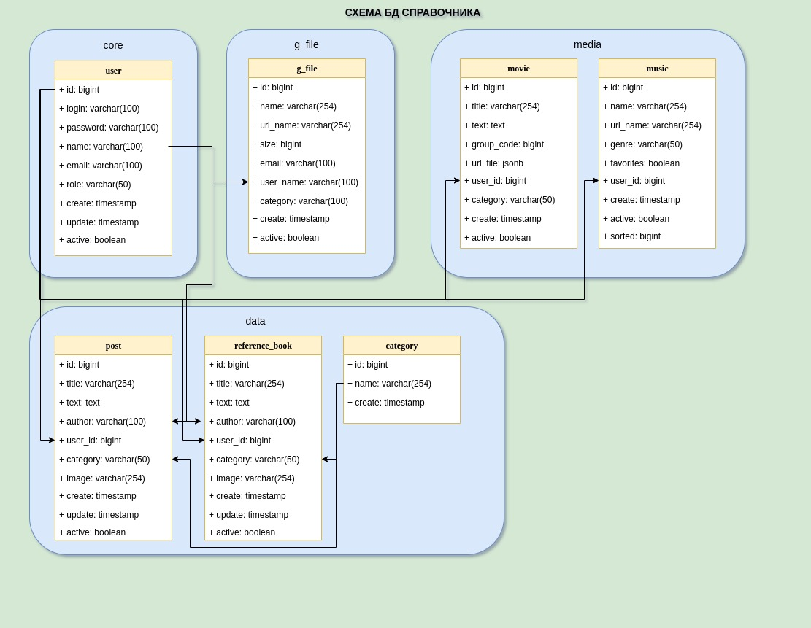

# Домашнее задание
Разработка проекта.

# Цель:
Спроектировать свою первую базу данных на курсе.

# Результат:
Реализуйте сущности продукты, категории продуктов, цены, поставщики, производители, покупатели и покупки
Свои решения для этой схемы приветствуются.

# Описание задание:
+ схема документация
+ примеры бизнес-задач которые решает база
+ рекомендации к использованию репликации
+ рекомендации к резервному копированию

# Реализация:
+ Схема: 
+ db предназначена для хранения справочной информации, а так же медиа контента. Она предназначена для личного справочника и является частью сайта. Фронт на сайте React, бэкенд Spring.
+ Поскольку не является система высоконагруженной, достаточно логической репликации.
+ То же самое касается и резервного копирования. Достаточно производить раз в сутки.

