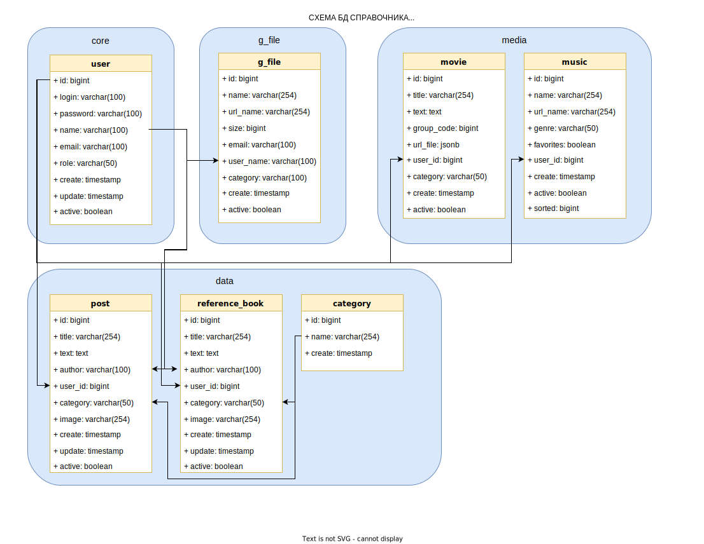

# Домашнее задание
Разработка проекта.

# Цель:
Спроектировать свою первую базу данных на курсе.

# Результат:
Реализуйте сущности продукты, категории продуктов, цены, поставщики, производители, покупатели и покупки
Свои решения для этой схемы приветствуются.

# Описание задание:
+ схема документация
+ примеры бизнес-задач которые решает база
+ рекомендации к использованию репликации
+ рекомендации к резервному копированию

# Реализация:
+ Схема 

