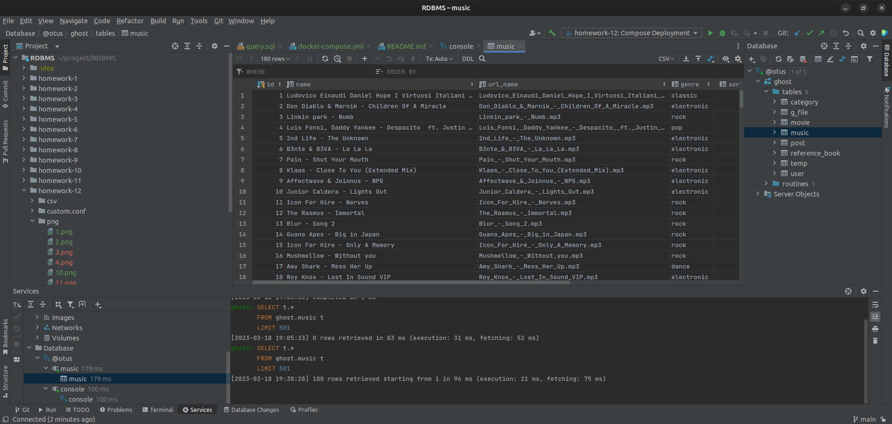

# Домашнее задание

Транзакции.

## Цель

+ Заполнение своего проекта данными.

## Описание задание

+ Описать пример транзакции из своего проекта с изменением данных в нескольких таблицах. Реализовать в виде хранимой
  процедуры.
+ Загрузить данные из приложенных в материалах csv.

## Реализация

### Реализация через LOAD DATA:

+ Чтобы не возникла проблема с датами выполняем следующий запрос:

```SQL 
set sql_mode = 'ALLOW_INVALID_DATES'; 
```

+ Проверяем путь до файлов MySql: 
+ Выполняем загрузку:

```SQL
load data infile '/var/lib/mysql-files/movie.csv'
    into table movie
    fields terminated by ','
    enclosed by '"'
    lines terminated by '\n'
    (id, title, text, group_code, url_file, category, user_id, created, active);
```

+ Результат операции: 
+ Результат загрузки: 
+ К сожалению через mysqlimport не удалось выполнить(((: 

### Реализация хранимой процедуры:

+ Запускаю docker-compose которай запустит контейнер, скрипт и помещает файл movie.csv в
  /var/lib/mysql-files/ 
+ Созданная база данных: 
+ Созтаем таблицу temp:

```SQL
CREATE TABLE IF NOT EXISTS ghost.temp
(
    id        INT PRIMARY KEY AUTO_INCREMENT,
    name      VARCHAR(500) NOT NULL,
    url_name  VARCHAR(500) NOT NULL,
    genre     VARCHAR(50),
    sorted    INT,
    favorites BOOLEAN               DEFAULT FALSE,
    user_id   INT          NOT NULL REFERENCES user (id) ON UPDATE CASCADE,
    created   TIMESTAMP    NOT NULL DEFAULT CURRENT_TIMESTAMP,
    active    BOOLEAN               DEFAULT TRUE
);
```

+ Копируем данные из файла music.csv в таблицу temp: 
+ Создаем хранимую процедуру:

```SQL
create procedure ghost.copy_data_music()
begin
    insert into ghost.music
    select *
    from ghost.temp;
end;
```

+ Выполняем ее: 
+ Результат: 
