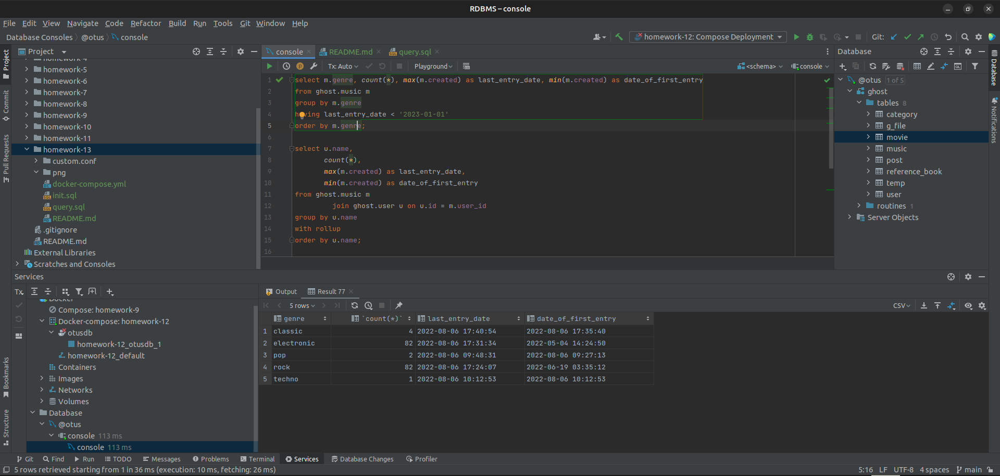
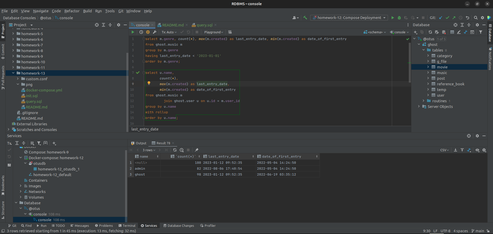
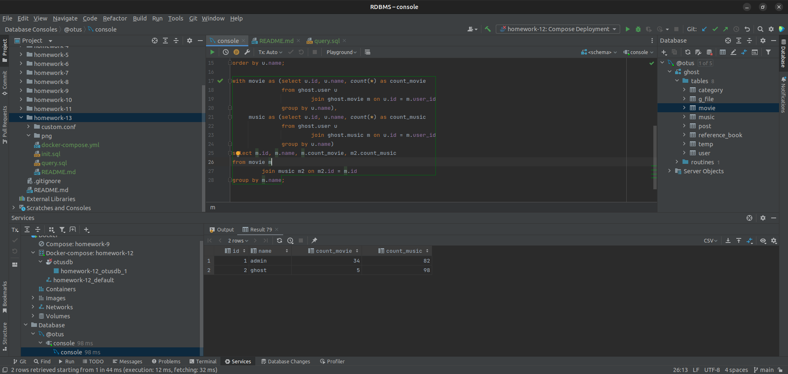

# Домашнее задание

Создаем отчетную выборку.

## Цель

+ Научимся создавать ответную выборку.

## Описание задание

+ Группировки с использованием CASE, HAVING, ROLLUP, GROUPING().

## Реализация

+ Выборка всех добавленных композиций добавленных до 2023 года с группированных по жанру и выводом даты добавления 1
  композиции и последней. Сортировка по жанру:

```SQL 
select m.genre,
       count(*),
       max(m.created) as last_entry_date,
       min(m.created) as date_of_first_entry
from ghost.music m
group by m.genre
having last_entry_date < '2023-01-01'
order by m.genre;
```



+ Выборка с группировкой по имени пользователя и вывод количества добавленных композиций, а так же датой добавления
  первой и последней композиции. Вывод общего количества композиций и крайних дат через rollup:

```SQL 
select u.name,
       count(*),
       max(m.created) as last_entry_date,
       min(m.created) as date_of_first_entry
from ghost.music m
         join ghost.user u on u.id = m.user_id
group by u.name
with rollup
order by u.name;
```



+ Подсчет количества добавленных композиций и фильмок группированных по пользователям:

```SQL 
with movie as (select u.id, u.name, count(*) as count_movie
               from ghost.user u
                        join ghost.movie m on u.id = m.user_id
               group by u.name),
     music as (select u.id, u.name, count(*) as count_music
               from ghost.user u
                        join ghost.music m on u.id = m.user_id
               group by u.name)
select m.id, m.name, m.count_movie, m2.count_music
from movie m
         join music m2 on m2.id = m.id
group by m.name;
```


