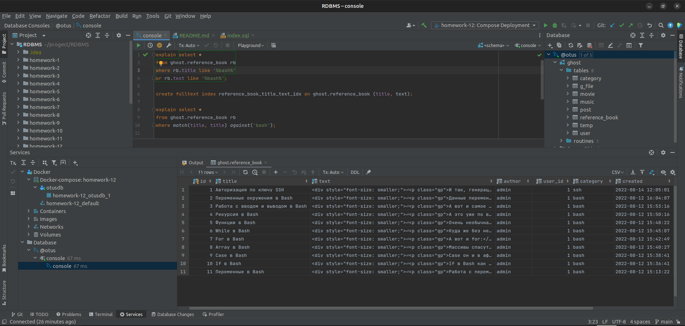
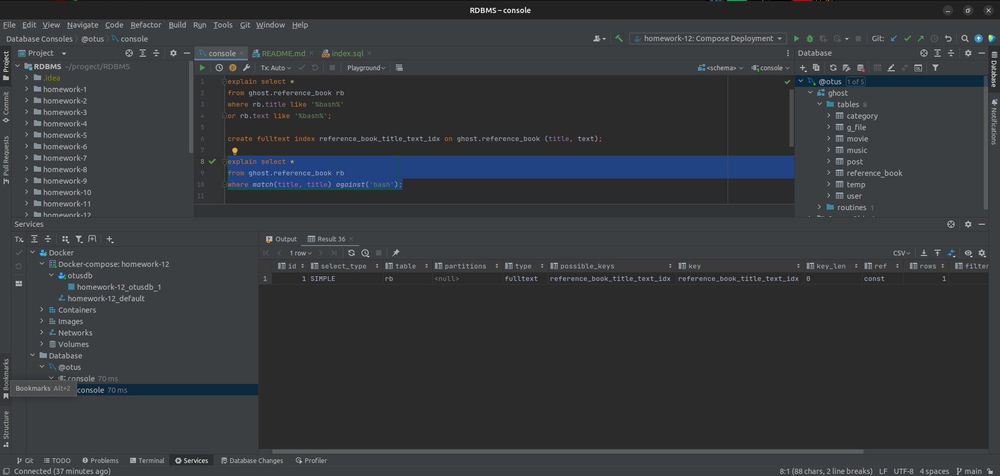
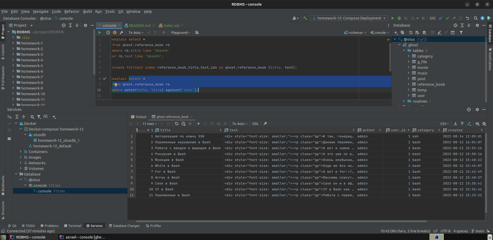

# Домашнее задание

Индексы.

## Цель

+ Научимся использовать индексы в MySQL.

## Описание задание

+ Пересматриваем индексы на своем проекте. По необходимости меняем.

## Реализация

+ Индекс для ускорения поиска при авторизации и регистрации(login уникален):

```SQL 
create index core_user_login_idx on ghost."user" (login);
```

+ Индексы для ускорения поиска по тексту записей в постах, справочниках, фильмах и название файлов и аудиофайлов:

```SQL
create fulltext index reference_book_title_text_idx on ghost.reference_book (title, text);
create fulltext index post_title_text_idx on ghost.post (title, text);
create fulltext index movie_title_text_idx on ghost.movie (title, text);
```

+ Индексы для ускоренного поиска файлов и песен по имени:

```SQL 
create index g_file_name_idx on ghost.g_file (name);
create index music_name_idx on ghost.music (name);
```

+ Индексы для получения записей согласно категориям:

```SQL 
create index reference_book_category_idx on ghost.reference_book (category);
create index post_category_idx on ghost.post (category);
```

### Реализация полнотекстового индекса.

+ Выполняем поиск без индекса:

```SQL 
select *
        from ghost.reference_book rb
        where rb.title like '%bash%'
           or rb.text like '%bash%';
```



+ Выполняем поиск с индекса:

```SQL 
explain select *
        from ghost.reference_book rb
        where match(title, title) against('bash');
```



+ Результат:

```SQL 
select *
from ghost.reference_book rb
where match(title, title) against('bash');
```


