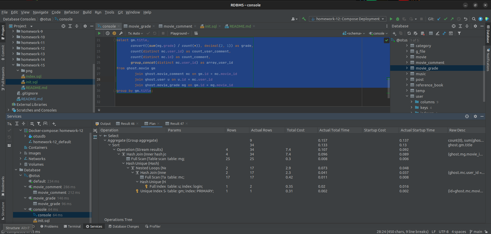
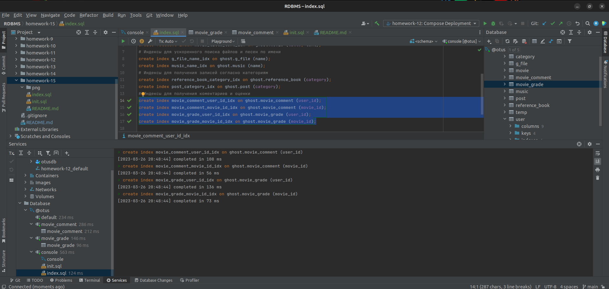
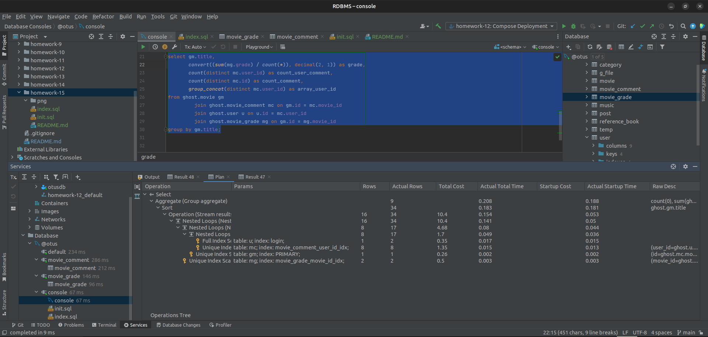
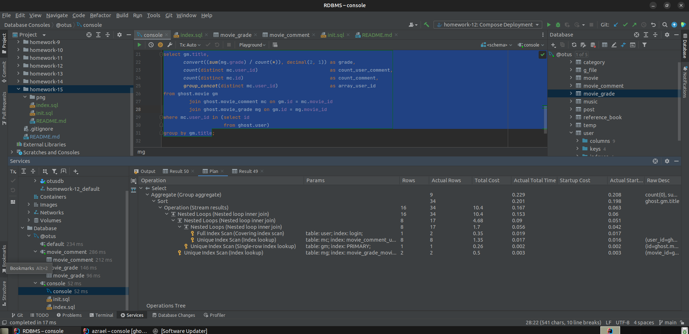
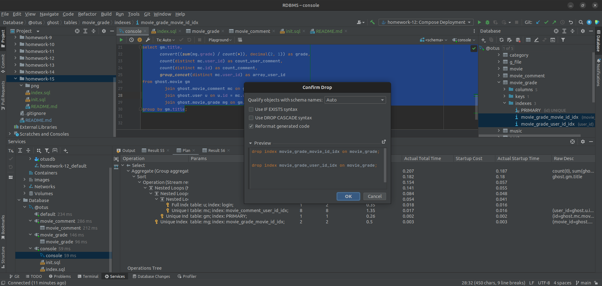
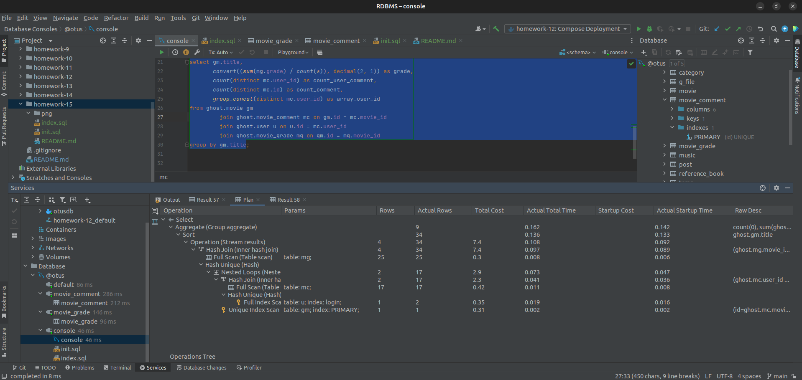
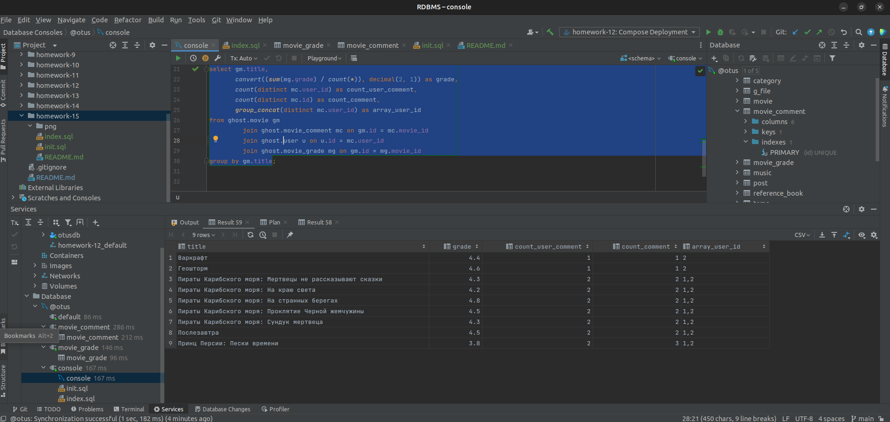

# Домашнее задание

Анализ и профилирование запроса.

## Цель

+ Проанализировать план выполнения запроса, оценить на чем теряется время.

## Описание задание

+ Возьмите сложную выборку из предыдущих ДЗ с несколькими join и под запросами постройте EXPLAIN в 3 формата.
+ Оцените план прохождения запроса, найдите самые тяжелые места.

## Реализация

+ Специально для этого и следующего ДЗ было добавлено 2 таблицы:

```SQL 
# Добавление таблицы оценки фильмов.

CREATE TABLE IF NOT EXISTS movie_grade
(
    id       INT PRIMARY KEY AUTO_INCREMENT,
    movie_id INT         NOT NULL REFERENCES movie (id) ON UPDATE CASCADE,
    grade    FLOAT(2, 1) NOT NULL,
    user_id  INT         NOT NULL REFERENCES user (id) ON UPDATE CASCADE,
    created  TIMESTAMP   NOT NULL DEFAULT CURRENT_TIMESTAMP
);
```

```SQL 
# Добавление таблицы комментариев к фильму.

CREATE TABLE IF NOT EXISTS movie_comment
(
    id       INT PRIMARY KEY AUTO_INCREMENT,
    movie_id INT       NOT NULL REFERENCES movie (id) ON UPDATE CASCADE,
    text     TEXT      NOT NULL,
    user_id  INT       NOT NULL REFERENCES user (id) ON UPDATE CASCADE,
    created  TIMESTAMP NOT NULL DEFAULT CURRENT_TIMESTAMP,
    active   BOOLEAN            DEFAULT TRUE
);
```

+ Так же был создан запрос по сбору статистики для таблицы хранящей фильмы. В данном запросе высчитывается средняя
  оценка от пользователей и количество комментариев к фильму с выводом id пользователей оставивших комментарии:

```SQL
select gm.title,
       convert((sum(mg.grade) / count(*)), decimal(2, 1)) as grade,
       count(distinct mc.user_id)                         as count_user_comment,
       count(distinct mc.id)                              as count_comment,
       group_concat(distinct mc.user_id)                  as array_user_id
from ghost.movie gm
         join ghost.movie_comment mc on gm.id = mc.movie_id
         join ghost.user u on u.id = mc.user_id
         join ghost.movie_grade mg on gm.id = mg.movie_id
group by gm.title;
```

+ Проверяем план выполнения запроса: 

+ Добавляем индексы и проверяем план повторно:

```SQL 
create index movie_comment_user_id_idx on ghost.movie_comment (user_id);
create index movie_comment_movie_id_idx on ghost.movie_comment (movie_id);
create index movie_grade_user_id_idx on ghost.movie_grade (user_id);
create index movie_grade_movie_id_idx on ghost.movie_grade (movie_id);
```





+ Пробуем убрать join с таблицей пользователей и переносим в where. Проверяем план повторно: 
+ Тот самый момент, когда оптимизация делает только хуже. Удаляем индексы и возвращаем запрос в исходное
  состояние: 
+ Проверяем план повторно: 
+ Выводим результат: 


