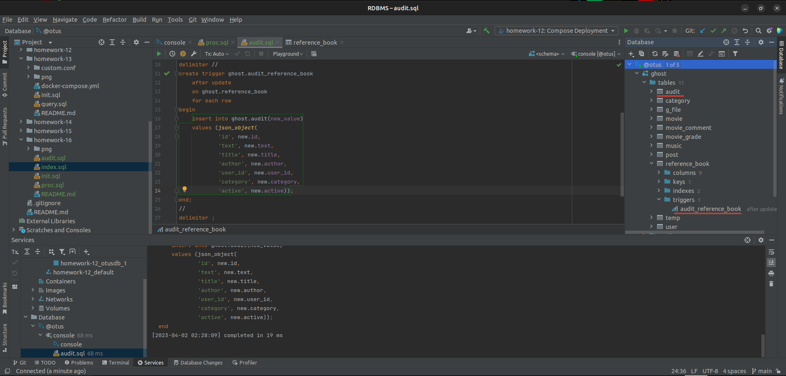
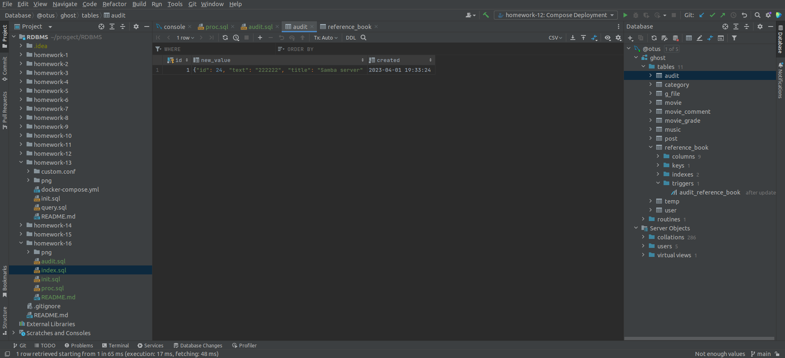
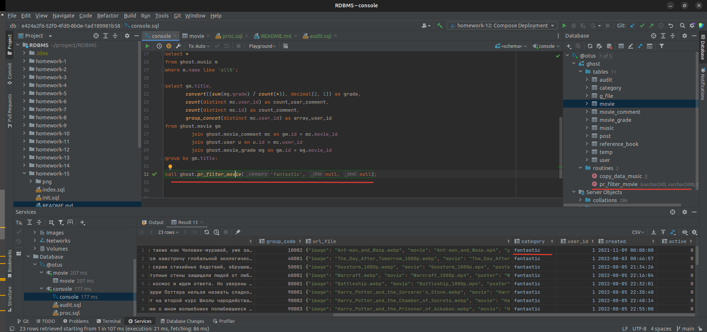
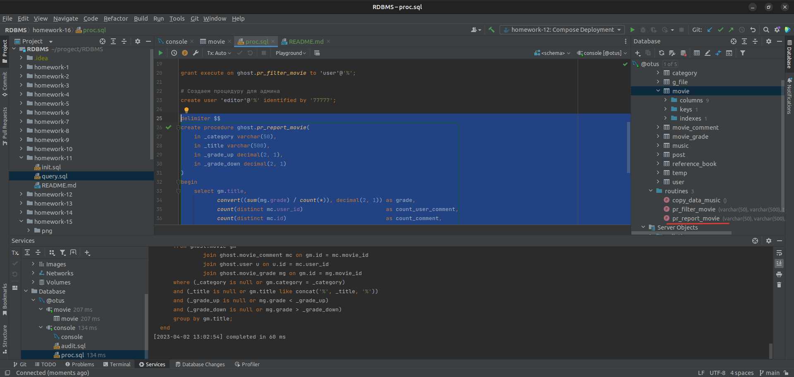
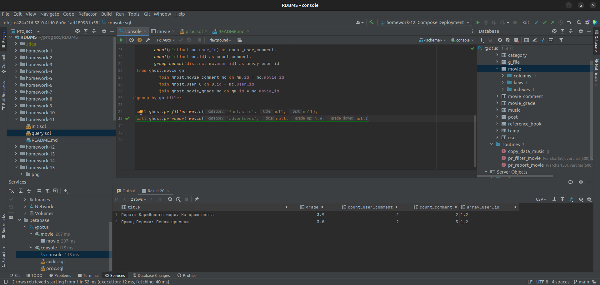

# Домашнее задание

Добавляем в базу хранимые процедуры и триггеры.

## Цель

+ Научиться создавать пользователей, процедуры и триггеры.

## Описание задание

+ Создать пользователей client, manager.
+ Создать процедуру выборки товаров с использованием различных фильтров: категория, цена, производитель, различные
  дополнительные параметры. Также в качестве параметров передавать по какому полю сортировать выборку, и параметры
  постраничной выдачи.
+ Дать права да запуск процедуры пользователю client.
+ Создать процедуру get_orders - которая позволяет просматривать отчет по продажам за определенный период (час, день,
  неделя) с различными уровнями группировки (по товару, по категории, по производителю).
+ Права дать пользователю manager.

## Реализация

### Триггер.

+ Добавляем таблицу аудита:

```SQL 
# Создаем таблицу аудита
create table if not exists ghost.audit
(
    id        int primary key auto_increment,
    new_value json,
    created   timestamp not null default current_timestamp
);
```

+ Создаем триггер:

```SQL 
# Создаем триггер для ведения аудита
delimiter $$
create trigger ghost.audit_reference_book
    after update
    on ghost.reference_book
    for each row
begin
    insert into ghost.audit(new_value)
    values (json_object(
            'id', new.id,
            'text', new.text,
            'title', new.title,
            'author', new.author,
            'user_id', new.user_id,
            'category', new.category,
            'active', new.active));
end;
$$
delimiter ;
```

+ Проверяем работу:  

### Процедуры.

+ Создаем пользователя и процедуру. В ней реализован фильтр для поиска фильмов:

```SQL
# Создаем процедуру для пользователя
create user 'user'@'%' identified by '12345';

delimiter $$
create procedure ghost.pr_filter_movie(
    in _category varchar(50),
    in _title varchar(500),
    in _text text
)
begin
    select *
    from ghost.movie gm
    where (_category is null or gm.category = _category)
      and (_title is null or gm.title like concat('%', _title, '%'))
      and (_text is null or gm.text like concat('%', _text, '%'));
end;
$$
delimiter ;

grant execute on ghost.pr_filter_movie to 'user'@'%';
```

+ Проверяем работу процедуры:

```SQL
call ghost.pr_filter_movie('fantastic', null, null);
```



+ Создаем пользователя и процедуру. В ней реализован отчет по фильмам:

```SQL 
# Создаем процедуру для editor
create user 'editor'@'%' identified by '77777';

delimiter $$
create procedure ghost.pr_report_movie(
    in _category varchar(50),
    in _title varchar(500),
    in _grade_up decimal(2, 1),
    in _grade_down decimal(2, 1)
)
begin
    select gm.title,
           convert((sum(mg.grade) / count(*)), decimal(2, 1)) as grade,
           count(distinct mc.user_id)                         as count_user_comment,
           count(distinct mc.id)                              as count_comment,
           group_concat(distinct mc.user_id)                  as array_user_id
    from ghost.movie gm
             join ghost.movie_comment mc on gm.id = mc.movie_id
             join ghost.user u on u.id = mc.user_id
             join ghost.movie_grade mg on gm.id = mg.movie_id
    where (_category is null or gm.category = _category)
      and (_title is null or gm.title like concat('%', _title, '%'))
      and (_grade_up is null or mg.grade < _grade_up)
      and (_grade_down is null or mg.grade > _grade_down)
    group by gm.title;
end;
$$
delimiter ;

grant execute on ghost.pr_filter_movie to 'editor'@'%';
```



+ Пробуем выполнить запрос:

```SQL
call ghost.pr_report_movie('adventures', null, 4.0, null);
```



+ Так же процедуру мы создавали ранее при копировании данных из csv
  файла: [12. Транзакции.](https://github.com/ghost-83/RDBMS/tree/main/homework-12)


