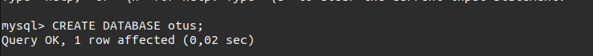
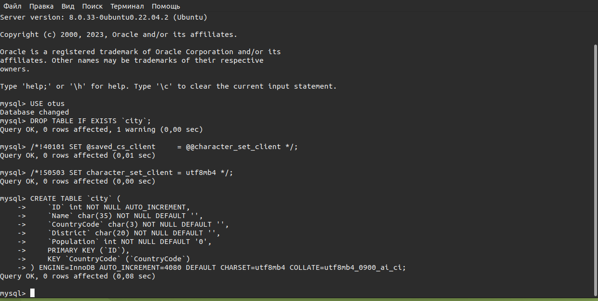
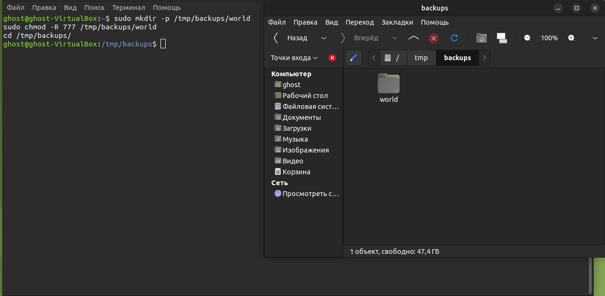
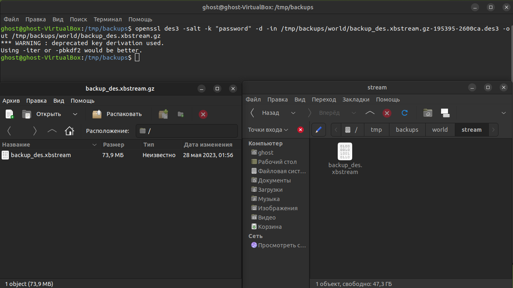
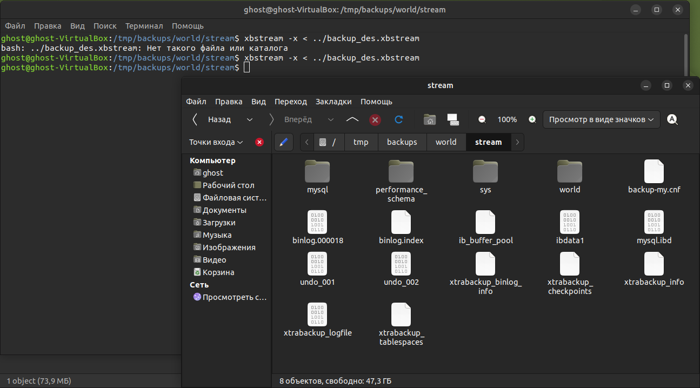
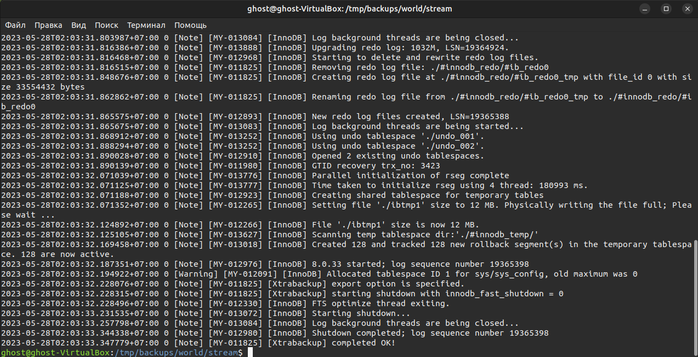
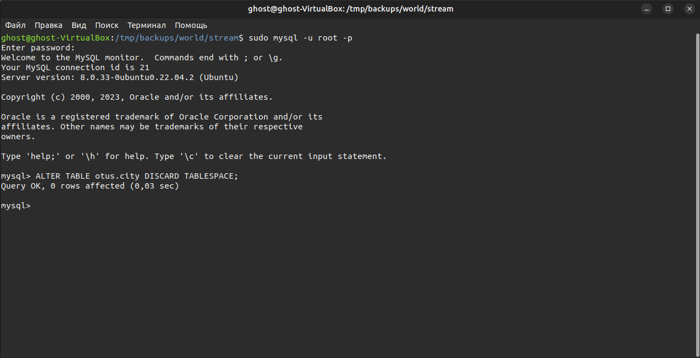
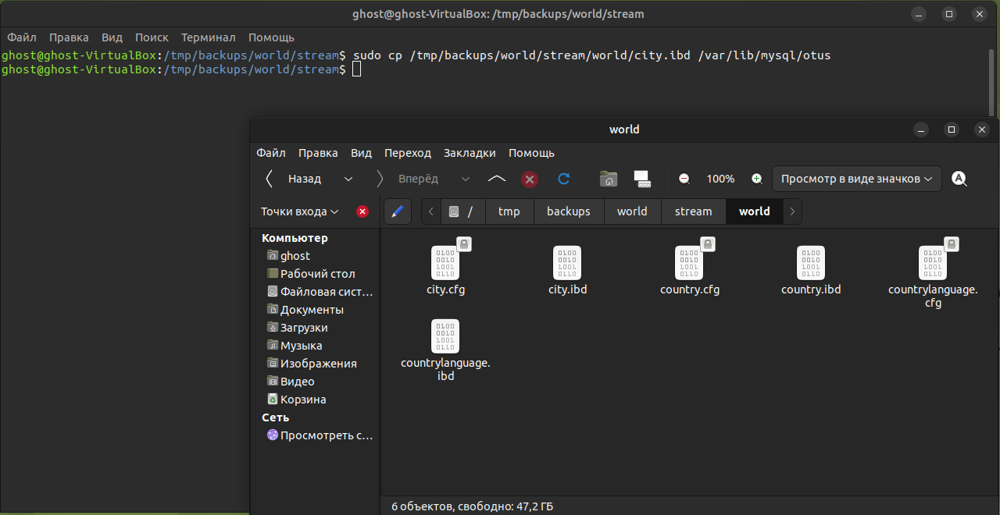
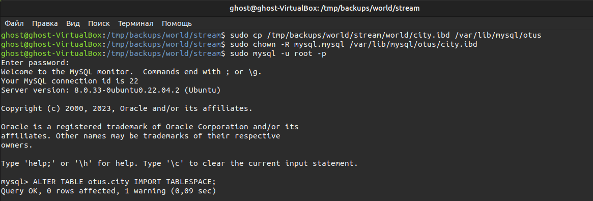
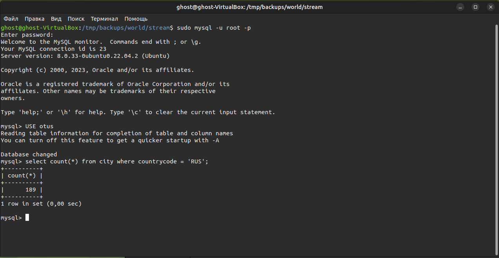

# Домашнее задание

Восстановить таблицу из бэкап.

## Цель

+ В этом ДЗ осваиваем инструмент для резервного копирования и восстановления - xtrabackup. Задача восстановить конкретную таблицу из сжатого и шифрованного бэкапа.

## Описание задание

+ В материалах приложен файл бэкап backup_des.xbstream.gz.des3 и дамп структуры базы world-db.sql.
+ Бэкап выполнен с помощью команды:
  sudo xtrabackup --backup --stream=xbstream
  --target-dir=/tmp/backups/xtrabackup/stream
  | gzip - | openssl des3 -salt -k "password" \
  stream/backup_des.xbstream.gz.des3
+ Требуется восстановить таблицу world.city из бэкапа и выполнить оператор:
  select count(*) from city where countrycode = 'RUS';.
+ Результат оператора написать в чат с преподавателем.

## Реализация

+ Создали БД и таблицу: 

 

+ Создаем директории: 

+ Расшифровываем и распаковываем файл бэкап: 

+ Извлекаем бэкап: 

+ Извлекаем бэкап отдельной таблицы: 

+ Отключаем таблицу: 

+ Восстанавливаем бэкап: 

+ Восстанавливаем tablespace: 

+ Результат: 

