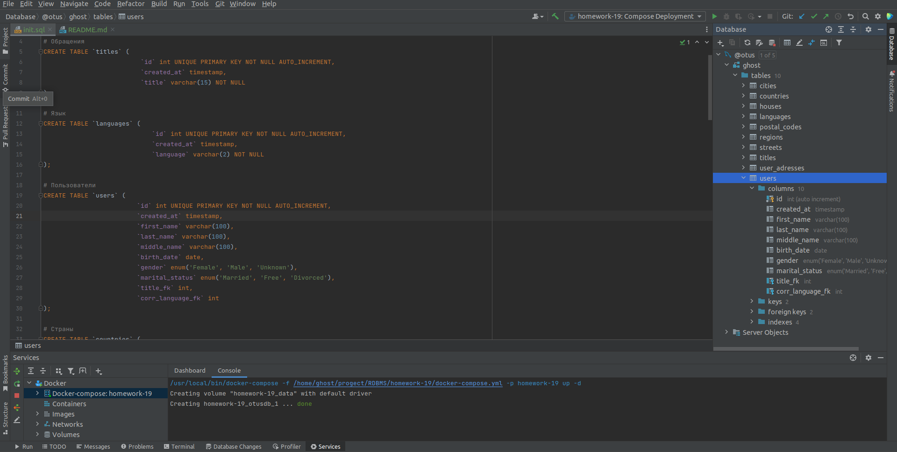
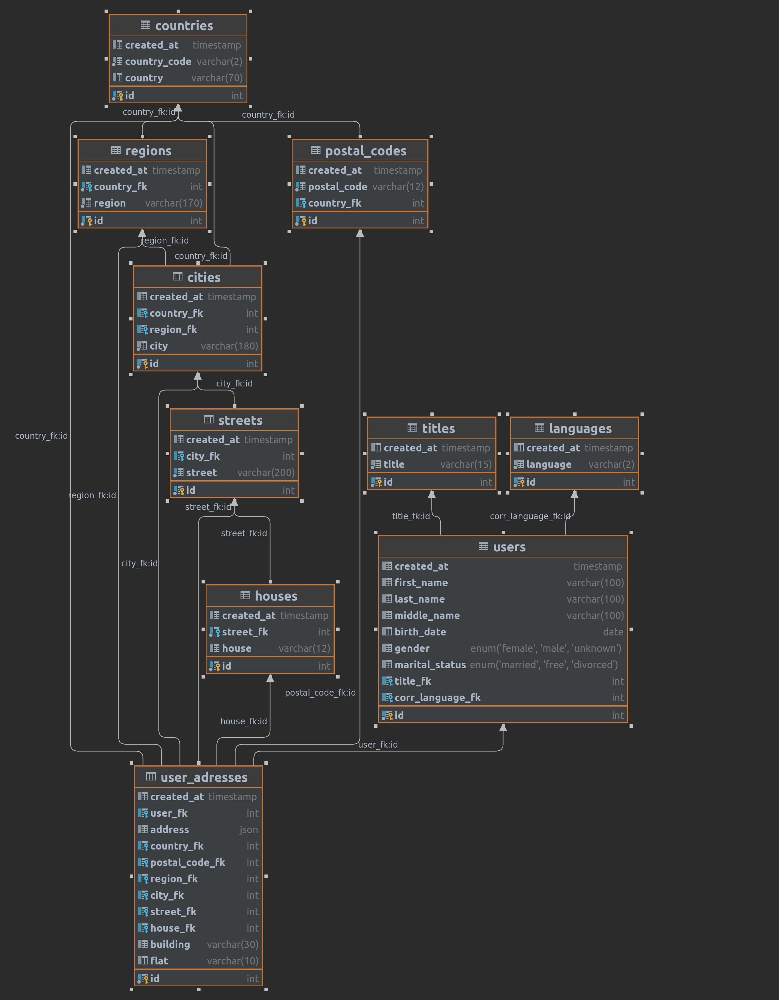

# Домашнее задание

Строим модель данных.

## Цель

+ Научиться проектировать БД.

## Задача

+ Реализовать модель данных БД, определить сущности, построить связи, выполнить декомпозицию и нормализацию
  За основу берем практическую структуру данных с заказчиками интернет магазина (файл some_customers.csv.gz).

## Описание задание

### Текущая структура данных неоптимальна:

+ Нет типизации - почти все поля хранятся как строки.
+ Данные не нормализованы - данные об адресе и человеке хранятся в одной таблице, на одного человека может приходится несколько адресов.

### Попытаться выделить следующие сущности:

+ Страны.
+ Города.
+ Улицы.
+ Дома.
+ И другие которые посчитаете нужными.

## Реализация

###  Рассмотрев содержимое файла напрашиваются следующие структуры хранения данных:

+ Пол и семейное положение можно сохранить в ENUM:

``` 
`gender` enum('Female', 'Male', 'Unknown')
`marital_status` enum('Married', 'Free', 'Divorced')
```

+ Для хранения обращения создадим справочник:

```SQL 
# Обращения
CREATE TABLE `titles` (
                        `id` int UNIQUE PRIMARY KEY NOT NULL AUTO_INCREMENT,
                        `created_at` timestamp,
                        `title` varchar(15) NOT NULL
);
```

+ Для хранения языков создадим справочник:

```SQL 
# Язык
CREATE TABLE `languages` (
                           `id` int UNIQUE PRIMARY KEY NOT NULL AUTO_INCREMENT,
                           `created_at` timestamp,
                           `language` varchar(2) NOT NULL
);
```

+ Для хранения пользователей создадим производную таблицу:

```SQL 
# Пользователи
CREATE TABLE `users` (
                       `id` int UNIQUE PRIMARY KEY NOT NULL AUTO_INCREMENT,
                       `created_at` timestamp,
                       `first_name` varchar(100),
                       `last_name` varchar(100),
                       `middle_name` varchar(100),
                       `birth_date` date,
                       `gender` enum('Female', 'Male', 'Unknown'),
                       `marital_status` enum('Married', 'Free', 'Divorced'),
                       `title_fk` int,
                       `corr_language_fk` int
);
```

+ Для хранения стран создадим справочник:

```SQL 
# Страны
CREATE TABLE `countries` (
                           `id` int UNIQUE PRIMARY KEY NOT NULL AUTO_INCREMENT,
                           `created_at` timestamp,
                           `country_code` varchar(2) NOT NULL,
                           `country` varchar(70)
);
```

+ Для хранения регионов создадим справочник со ссылкой на страну:

```SQL 
# Регионы
CREATE TABLE `regions` (
                         `id` int UNIQUE PRIMARY KEY NOT NULL AUTO_INCREMENT,
                         `created_at` timestamp,
                         `country_fk` int NOT NULL,
                         `region` varchar(170) NOT NULL
);
```

+ Для хранения почтовых индексов создадим справочник со ссылкой на страну:

```SQL 
# Почтовые индексы
CREATE TABLE `postal_codes` (
                              `id` int UNIQUE PRIMARY KEY NOT NULL AUTO_INCREMENT,
                              `created_at` timestamp,
                              `postal_code` varchar(12) UNIQUE NOT NULL,
                              `country_fk` int
);
```

+ Для хранения городов создадим справочник со ссылкой на страну и регион:

```SQL 
# Города
CREATE TABLE `cities` (
                        `id` int UNIQUE PRIMARY KEY NOT NULL AUTO_INCREMENT,
                        `created_at` timestamp,
                        `country_fk` int,
                        `region_fk` int,
                        `city` varchar(180) NOT NULL
);
```

+ Для хранения улиц создадим справочник со ссылкой на город:

```SQL 
# Улицы
CREATE TABLE `streets` (
                         `id` int UNIQUE PRIMARY KEY NOT NULL AUTO_INCREMENT,
                         `created_at` timestamp,
                         `city_fk` int,
                         `street` varchar(200) UNIQUE NOT NULL
);
```

+ Для хранения домов создадим справочник со ссылкой на улицы:

```SQL 
# Дома
CREATE TABLE `houses` (
                        `id` int UNIQUE PRIMARY KEY NOT NULL AUTO_INCREMENT,
                        `created_at` timestamp,
                        `street_fk` int NOT NULL,
                        `house` varchar(12)
);
```

+ Адрес из формы будем сохранять в json в полученном виде. Так же предусмотрим поле на случай возможных проблем с домами. Для связи пользователей с компонентами адреса создадим производную таблицу:

```SQL 
# Адреса
CREATE TABLE `user_adresses` (
                               `id` int UNIQUE PRIMARY KEY NOT NULL AUTO_INCREMENT,
                               `created_at` timestamp,
                               `user_fk` int,
                               `address` json,
                               `country_fk` int,
                               `postal_code_fk` int,
                               `region_fk` int,
                               `city_fk` int,
                               `street_fk` int,
                               `house_fk` int,
                               `building` varchar(30),
                               `flat` varchar(10)
);
```

+ Примерная структура таблиц и схема выглядят примерно так: 

 


