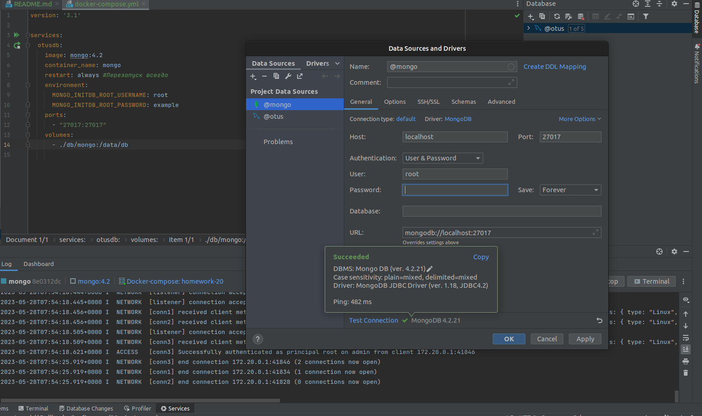
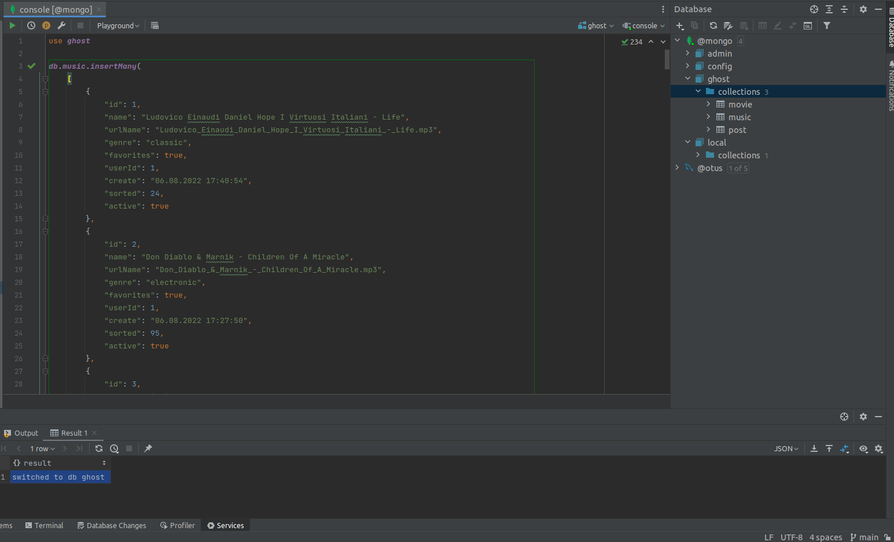
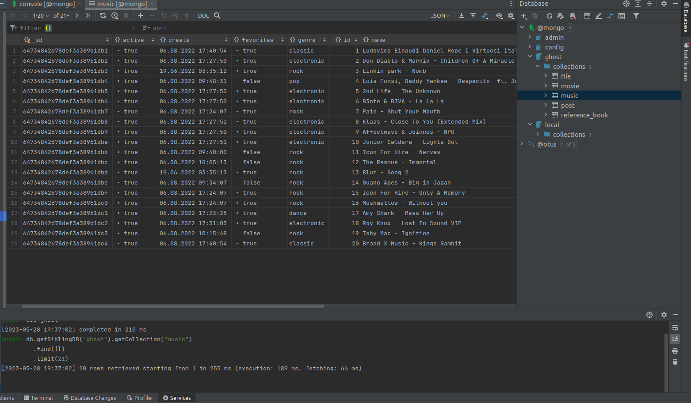
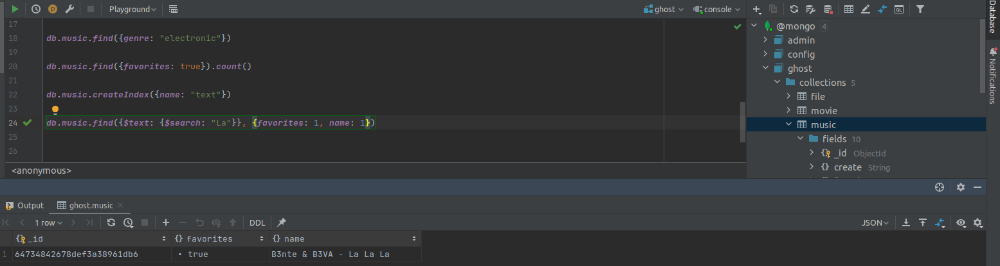
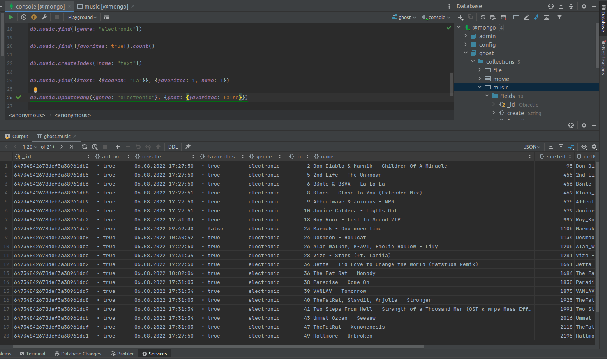
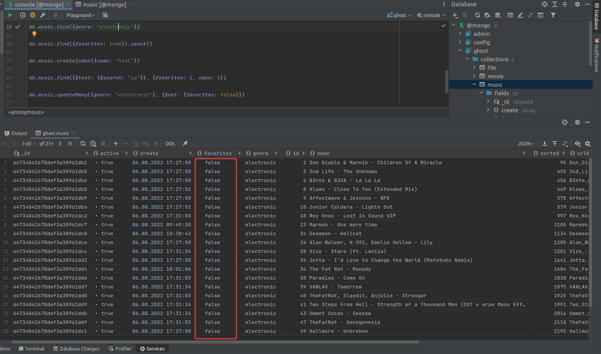

# Домашнее задание

MongoDB.

## Цель

+ В результате выполнения ДЗ вы научитесь разворачивать MongoDB, заполнять данными и делать запросы.

## Описание задание

+ Установить MongoDB одним из способов: ВМ, докер.
+ Заполнить данными.
+ Написать несколько запросов на выборку и обновление данных.

## Реализация

###  Запуск и подключение:

+ Запуск проводим через docker с использованием docker-compose:

``` yaml
version: '3.1'

services:
  otusdb:
    image: mongo:4.2
    container_name: mongo
    restart: always
    environment:
      MONGO_INITDB_ROOT_USERNAME: root
      MONGO_INITDB_ROOT_PASSWORD: example
    ports:
      - "27017:27017"
    volumes:
      - ./db/mongo:/data/db
```

+ Подключаемся к db через IntelliJ IDEA:



###  Создание и заполнение:

+ Создаем db:

```mongodb-json 
use ghost
```

+ Заполняем базу данными:
```mongodb-json 
db.file.insertMany(
    [
        {
            "id": 1,
            "name": "terminal.jpg",
            "urlName": "terminal.jpg",
            "size": 317855,
            "userName": "ghost_83",
            "category": "image",
            "create": "19.06.2022 03:43:27",
            "active": true
        }
    ]
    )
```





###  Выборка и обновление:

+ Посчитаем количество объектов в коллекции music по полю "избранное" true:

```mongodb-json 
db.music.find({favorites: true}).count()
```


+ Выполним поиск по тексту в коллекции music. Перед этим создадим индекс для поиска:

```mongodb-json 
db.music.createIndex({name: "text"})

db.music.find({$text: {$search: "La"}}, {favorites: 1, name: 1})
```



+ Обновим поле "избранное" в false для объектов в коллекции music имеющих жанр "electronic":

```mongodb-json 
db.music.updateMany({genre: "electronic"}, {$set: {favorites: false}})
```



+ Выполним выборку объектов в коллекции music по жанру, убедимся что все обновилось:

```mongodb-json 
db.music.find({genre: "electronic"})
```


