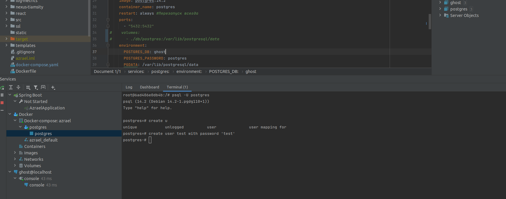
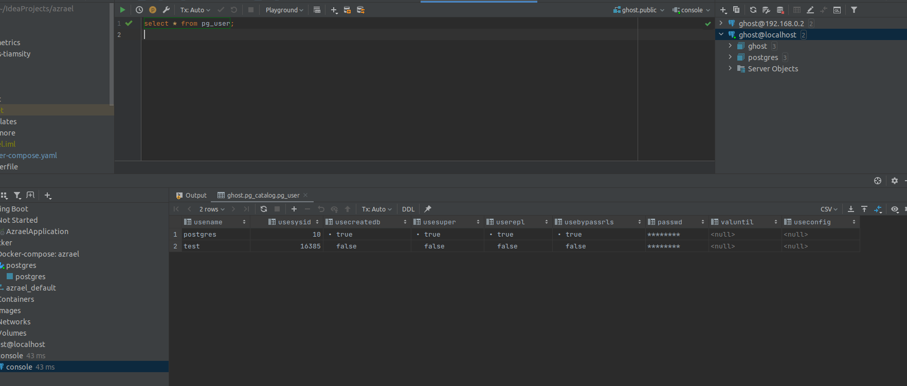

# Домашнее задание

Установка СУБД PostgreSQL.

## Цель

Создать кластер PostgreSQL в докере или на виртуальной машине, запустить сервер и подключить клиента.

## Описание задание

+ Развернуть контейнер с PostgreSQL или установить СУБД на виртуальную машину.
+ Запустить сервер.
+ Создать клиента с подключением к базе данных postgres через командную строку.
+ Подключиться к серверу используя pgAdmin или другое аналогичное приложение.

## Реализация

+ Запуск ДБ. 
+ Создание пользователя. 
+ Подключение к БД. 
