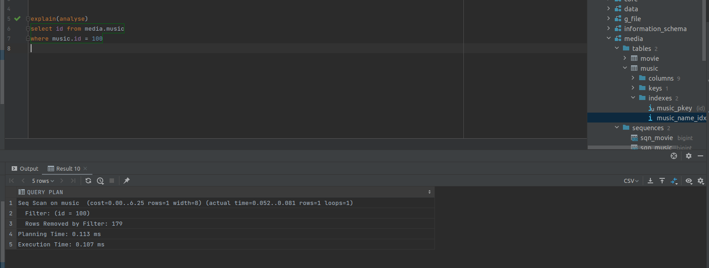

# Домашнее задание

Индексы PostgreSQL.

## Цель

Знать и уметь применять основные виды индексов PostgreSQL.
Построить и анализировать план выполнения запроса.
Уметь оптимизировать запросы для с использованием индексов.

## Описание задание

Создать индексы на БД, которые ускорят доступ к данным:

+ Создать индекс к какой-либо из таблиц вашей БД.
+ Прислать текстом результат команды explain, в которой используется данный индекс.
+ Реализовать индекс для полнотекстового поиска.
+ Создать индекс на несколько полей.
+ Написать комментарии к каждому из индексов.
+ Описать что и как делали и с какими проблемами столкнулись.

## Реализация

+ explain: 
+ PG не использовал index так как в моей db слишком мало записей(((.
