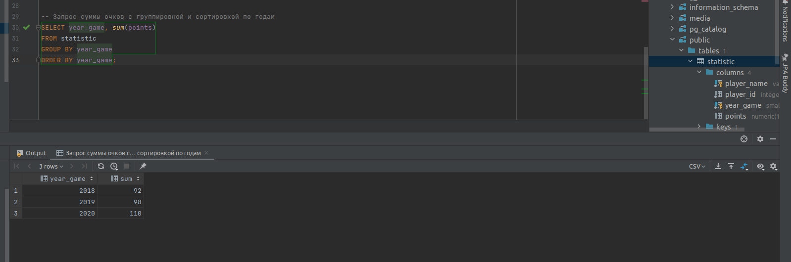
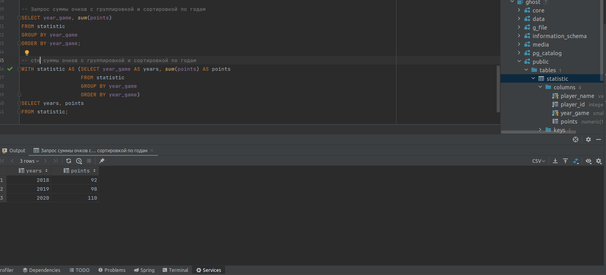
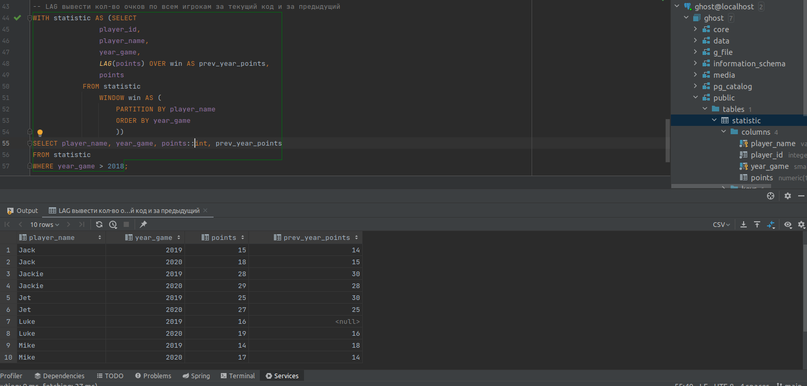

# Домашнее задание

Посчитать кол-во очков по всем игрокам за текущий год и за предыдущий.

## Цель

Научиться использовать функцию LAG и CTE.

## Описание задание

+ Создайте таблицу.
+ Наполните ее данными.
+ Написать запрос суммы очков с группировкой и сортировкой по годам.
+ Написать cte показывающее тоже самое.
+ Используя функцию LAG вывести кол-во очков по всем игрокам за текущий код и за предыдущий.

## Реализация

+ Запрос суммы очков с группировкой и сортировкой по годам: 
+ CTE суммы очков с группировкой и сортировкой по годам: 
+ LAG вывести кол-во очков по всем игрокам за текущий код и за предыдущий: 
