# Домашнее задание

Делаем физическую и логическую репликации.

## Цель

После домашнего задания вы сможете настраивать физическую и логическую репликации самостоятельно.

## Описание задание

### Физическая реализация:

+ Настроить физическую репликации между двумя кластерами базы данных.
+ Репликация должна работать использую "слот репликации".
+ Реплика должна отставать от мастера на 5 минут.

### Логическая реализация:

+ Создать на первом кластере базу данных, таблицу и наполнить ее данными (на ваше усмотрение).
+ На нем же создать публикацию этой таблицы.
+ На новом кластере подписаться на эту публикацию.
+ Убедиться что она среплицировалась. Добавить записи в эту таблицу на основном сервере и убедиться, что они видны на логической реплике.

## Реализация

### Физическая реализация:

+ Создаем 2 кластера: maim и main2.
+ Удаляем файлы из main2: 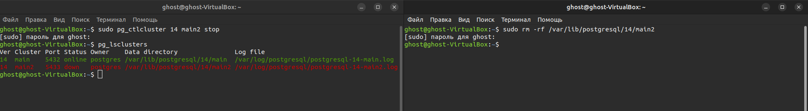
+ Настраиваем доступ к main и задаем время задержки репликации: 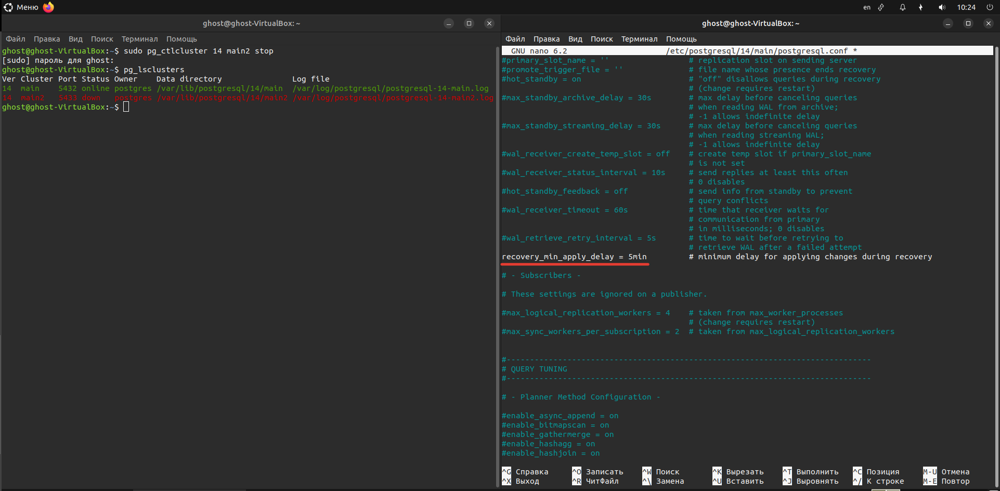
+ Проверяем выставленный "слот репликации": 
```show wal_level;```
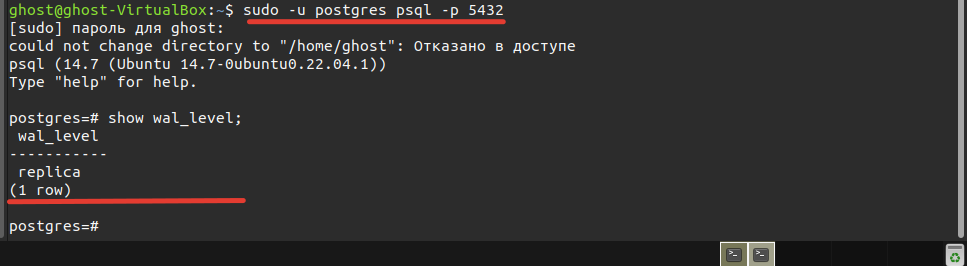
+ Делаем бэкап нужной директории с мастера: 
```SHEL 
sudo -u postgres pg_basebackup -p 5432 -R -D /var/lib/postgresql/14/main2
```
+ Стартуем кластер реплики: 
```SHEL 
sudo pg_ctlcluster 14 main2 start
```
+ Проверяем состояние на мастере: 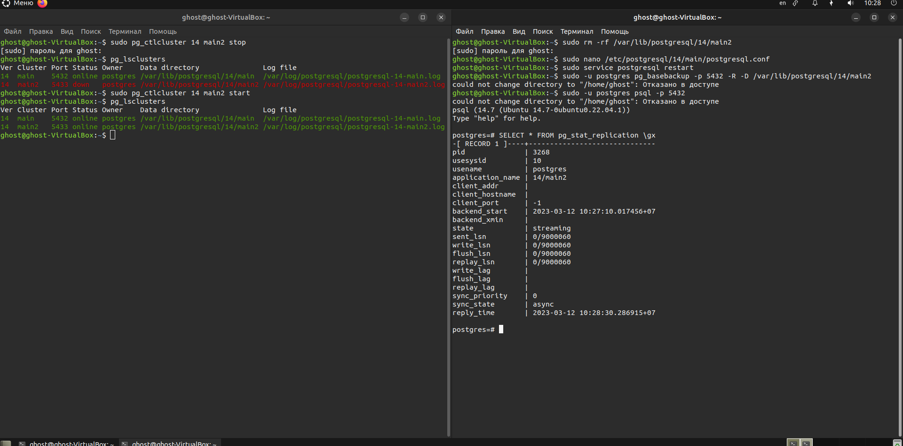
+ Проверяем состояние на реплике: 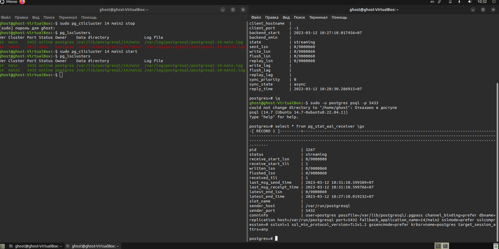
+ Проверяем что данные с мастера перенеслись на реплику: 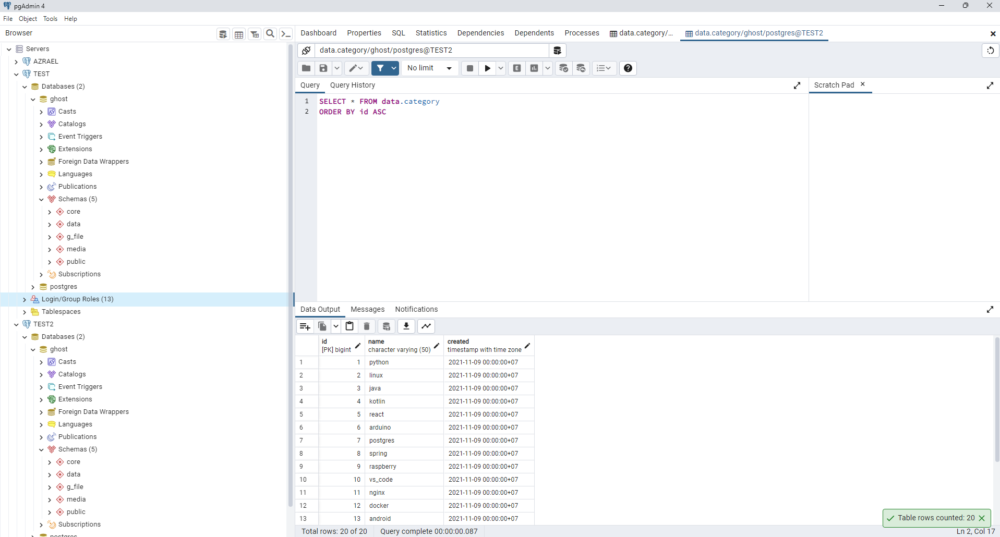

### Логическая реализация:

+ Создаем кластер main3: 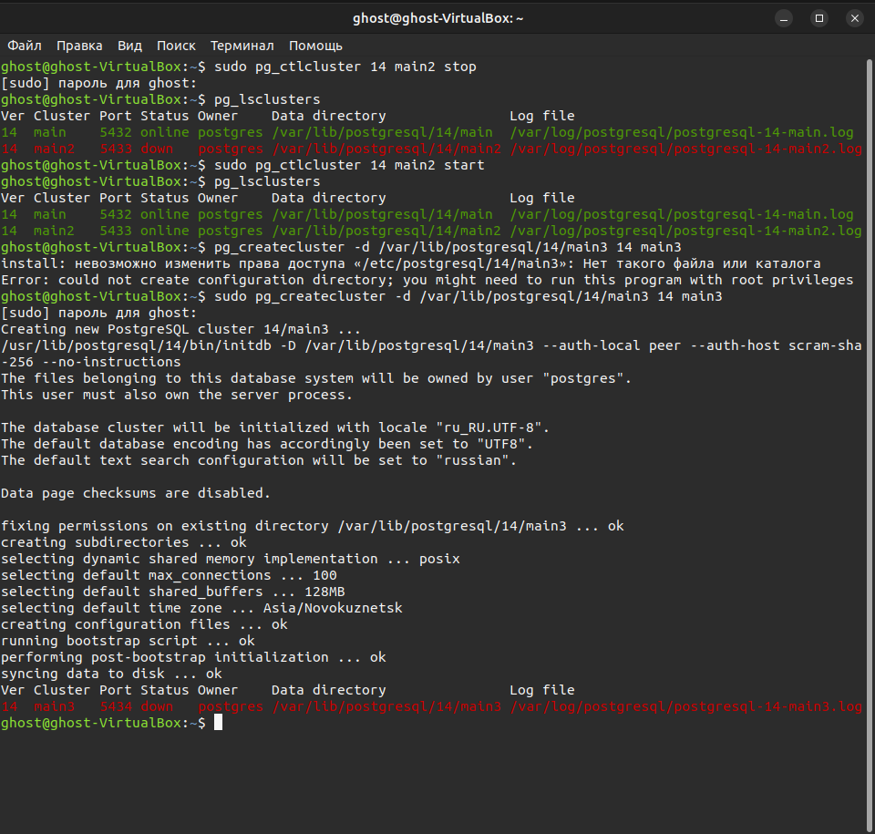
+ Насраиваем доступ к main3: 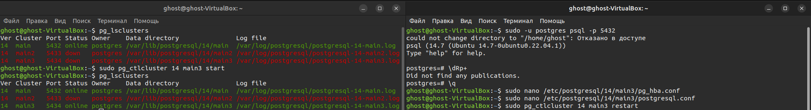
+ Выставляем на main "слот репликации" logical: 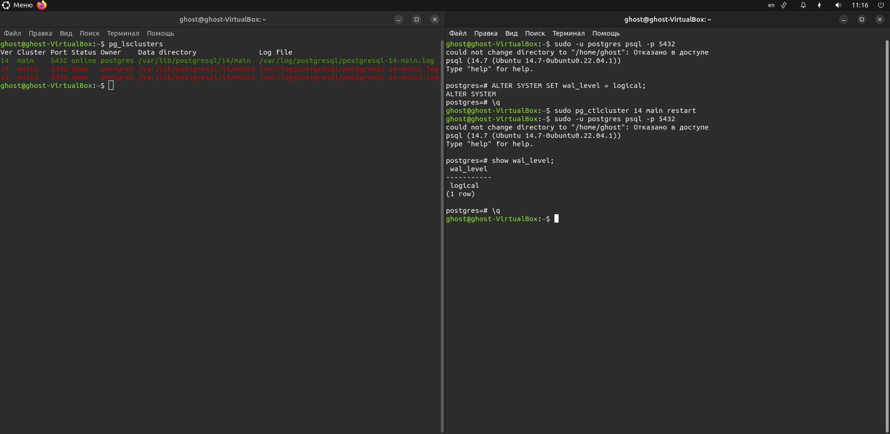
+ Создаем публикацию таблицы data.category: 
```SQL
CREATE PUBLICATION data_pub FOR TABLE data.category;
```
+ Проверяем публикацию и залаем пароль пользователю: 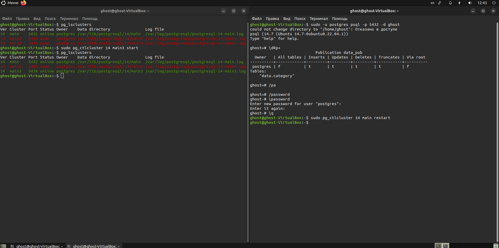
+ Создаем на кластере main3 базу данных и схемы с таблицами как на main, но не заполняем таблицу data.category.
+ На кластере main3 добавляем подписку на публикацию таблицы data.category с кластера main: 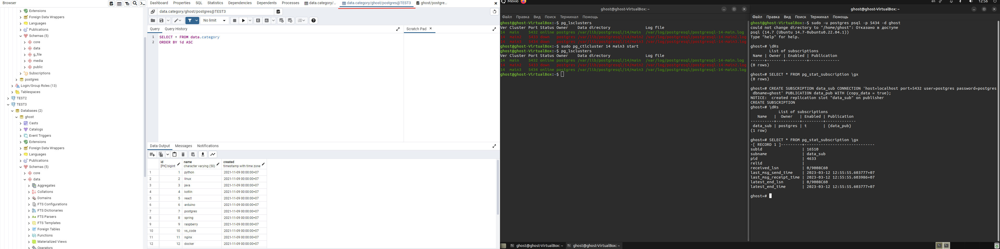
+ Добавляем запись в таблицу кластера main: 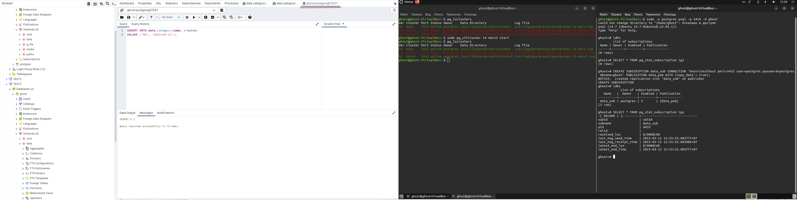
+ Проверяем запись в таблицу кластера main: 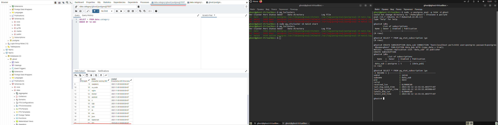
+ Проверяем что запись появилась в таблицу кластера main3: 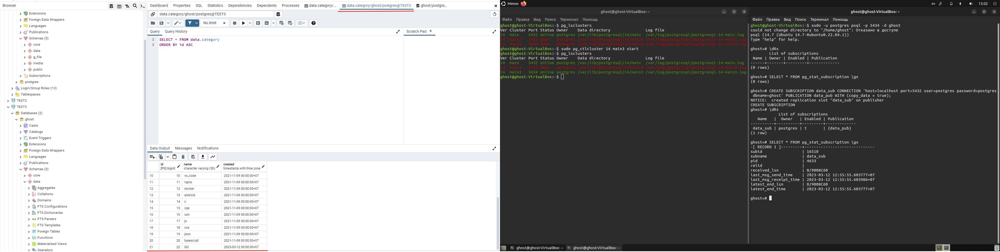
+ Смотрим logs: 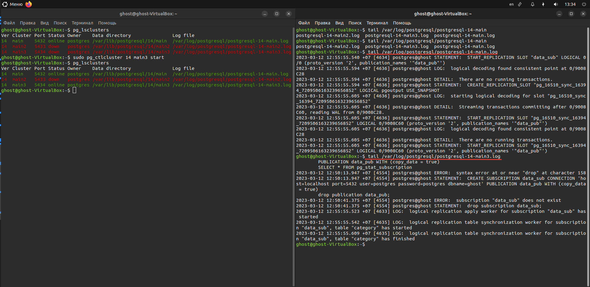
