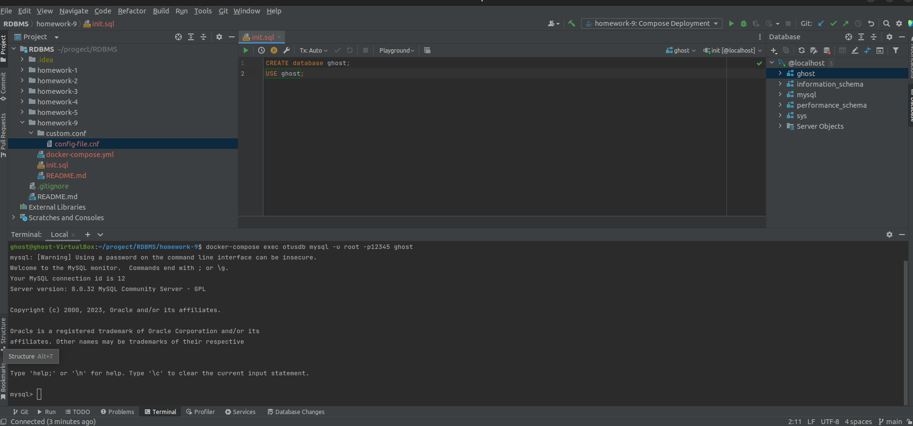

# Домашнее задание

Создаем базу данных MySQL в докере.

## Цель

+ Упаковка скриптов создания БД в контейнер.

## Описание задание

+ Забрать стартовый репозиторий https://github.com/aeuge/otus-mysql-docker.
+ Прописать sql скрипт для создания своей БД в init.sql.
+ Проверить запуск и работу контейнера следую описанию в репозитории.
+ Прописать кастомный конфиг - настроить innodb_buffer_pool и другие параметры по желанию.

## Реализация

+ Поднять сервис db_va можно командой:

`docker-compose up otusdb`
+ Для подключения к БД используйте команду:

`docker-compose exec otusdb mysql -u root -p12345 ghost`
+ Для использования в клиентских приложениях можно использовать команду:

`mysql -u root -p12345 --port=3309 --protocol=tcp ghost`

